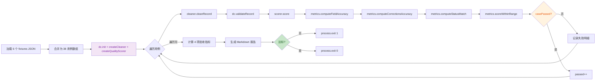

# Benchmark 层深度审查报告

> **审查日期**：2026-06-28
> **审查范围**：`src/data-cleaning/benchmark/` 全层（fixtures/ + metrics.js + run-benchmark.js）
> **审查类型**：端到端验收基准层的设计质量、覆盖率、与 core/ 引擎的一致性
> **整体评价**：指标体系设计合理、fixtures 业务覆盖度尚可，但存在 **2 个 Critical 阻断问题**导致运行器完全无法运行；另有多个 High 级逻辑缺陷使部分指标实际未参与判定。

---

## 一、架构总览

### 1.1 benchmark 层定位

| 维度 | benchmark/ | core/test-*.js |
|------|-----------|----------------|
| **目标** | 端到端业务正确性验收 | 单元/集成测试 |
| **数据来源** | 6 个 fixtures JSON（38 用例） | 内联代码 assert |
| **校验对象** | DataCleaner + rules.validateRecord + QualityScorer 全链路 | 单个类/函数 |
| **输出** | Markdown 报告（docs/reports/benchmark_*.md） | 控制台日志 |
| **退出码** | 0/1（CI 友好） | 0/1 |

benchmark 层是端到端黑盒验收层，定位明确，与 core/test-*.js 形成互补关系——前者验证业务流，后者验证函数级正确性。

### 1.2 6 类 fixtures 覆盖维度

| Fixture 文件 | 用例数 | SchemaKey | 业务覆盖 |
|--------------|--------|-----------|----------|
| customer-cases.json | 12 | customer | 客户咨询主流程 |
| project-cases.json | 5 | project | 拍摄项目立项 |
| product-cases.json | 5 | product | 成品发布 |
| resource-cases.json | 6 | resource | 资源（模特/场地）入库 |
| chat-cases.json | 5 | customer | 聊天记录非结构化输入 |
| batch-cases.json | 5 | customer | 批量导入场景 |
| **合计** | **38** | 4 类 | 5 个业务场景 |

### 1.3 run-benchmark.js 执行流程



实际执行因 **Critical 阻断**（详见第七章 BENCH-001 / BENCH-002）在第 C 步即崩溃，无法走完全流程。

---

## 二、fixtures 用例覆盖度审查

### 2.1 用例统计

逐文件统计结果见 1.2 节。总计 38 用例，集中在 4 张 schema 上。

### 2.2 场景类型分布（按 expectedStatus / expectedErrorCodes）

| 场景 | 用例 ID | 数量 | 占比 |
|------|---------|------|------|
| 正常通过（passed） | customer-001/002/005/006/007/009/010/012, project-001/002/004/005, product-001/004/005, resource-001/003/005/006, chat-001~005, batch-001/002/004 | 23 | 60.5% |
| 必填缺失（REQUIRED_MISSING） | customer-003/011, project-003, product-002, resource-002, batch-003/005 | 7 | 18.4% |
| 格式错误（FORMAT_ERROR） | customer-004 | 1 | 2.6% |
| 枚举不匹配（ENUM_MISMATCH） | customer-008, product-003 | 2 | 5.3% |
| 评分超范围（RANGE_ERROR） | resource-004 | 1 | 2.6% |
| 同义词映射场景 | customer-002/007, project-005, chat-002, batch-004 | 5 | 13.2% |

### 2.3 Schema 覆盖度评估

| Schema | 是否覆盖 | 用例数 | 说明 |
|--------|---------|--------|------|
| customer | ✅ | 22 | 充分（customer-cases + chat-cases + batch-cases） |
| project | ✅ | 5 | 基本覆盖（含状态机默认值/同义词） |
| product | ✅ | 5 | 基本覆盖（含非法枚举/状态跳转） |
| resource | ✅ | 6 | 基本覆盖（含评分超范围/URL/报价） |
| **material** | ❌ | 0 | **完全未覆盖**——素材库目录管理表无任何用例 |
| **research** | ❌ | 0 | **完全未覆盖**——爆款调研库表无任何用例 |
| **sop** | ❌ | 0 | **完全未覆盖**——话术库无任何用例 |

**覆盖率**：4/7 = 57%。三张未覆盖表均定义于 [schemas/index.js](file:///d:/360Downloads/Trae 项目/collator/src/data-cleaning/schemas/index.js#L6-L14)，且 schemas/customer.json 之外的字段集差异较大，缺失用例意味着对应 schema 的字段验证、状态机、关联规则完全未进入端到端基准。

### 2.4 错误码覆盖度评估

[rules/index.js](file:///d:/360Downloads/Trae 项目/collator/src/data-cleaning/rules/index.js#L22-L24) 共定义 15 个错误/警告 code，fixtures 仅覆盖 4 个：

| 错误码 | 严重度 | 是否覆盖 | 备注 |
|--------|--------|---------|------|
| REQUIRED_MISSING | error | ✅ | 7 用例 |
| FORMAT_ERROR | error | ✅ | 1 用例 |
| ENUM_MISMATCH | error | ✅ | 2 用例 |
| RANGE_ERROR | error | ✅ | 1 用例（number(rating)） |
| TYPE_ERROR | error | ❌ | 完全未覆盖 |
| INVALID_DATE | error | ❌ | 完全未覆盖（fixtures 中无非法日期） |
| DATE_CONFLICT | error | ❌ | 完全未覆盖（无拍摄日期早于咨询日期的用例） |
| MISSING_RELATION | error | ❌ | 完全未覆盖（无项目已成交但缺客户的用例） |
| SCHEMA_NOT_FOUND | error | ❌ | 合理未覆盖（异常路径） |
| VALIDATION_EXCEPTION | warning | ❌ | 合理未覆盖（异常路径） |
| STATE_NOT_INITIAL | warning | ❌ | project-004 实际触发但 expectedStatus 仍为 passed |
| BUDGET_MISMATCH | warning | ❌ | 未覆盖 |
| STYLE_WARNING | warning | ❌ | 未覆盖 |
| LOW_CONFIDENCE | warning | ❌ | 未覆盖 |
| LENGTH_WARNING | warning | ❌ | 未覆盖 |

**错误码覆盖率**：4/15 = 26.7%（仅计算 error 级则 4/9 = 44%）。

### 2.5 边界值覆盖

| 边界类型 | 是否覆盖 | 用例 |
|---------|---------|------|
| 空输入 `{}` | ✅ | customer-011、batch-005 |
| 预算边界值（1000元） | ✅ | customer-009 |
| 必填字段最小集 | ✅ | resource-002、project-003 |
| 微信号代替手机号 | ✅ | customer-012、resource-003 |
| 全角字符 | ✅ | customer-006 |
| 自然语言日期（今天/昨天） | ✅ | customer-005、chat-004 |
| 联系方式变体（括号/横杠） | ✅ | customer-001、chat-005、batch-002 |
| **多模态输入（imagePath/audioPath）** | ❌ | 完全未覆盖 |
| **跨表关联字段** | ❌ | 未覆盖（关联 ID 缺失场景） |
| **去重场景** | ❌ | 完全未覆盖（cleaning-rules.json 已配置 deduplicationRules 但无测试） |

### 2.6 覆盖缺口汇总

1. 3 张 schema 完全未覆盖（material / research / sop）
2. 11 个错误码未覆盖（含 5 个 error 级）
3. 多模态场景、跨表关联、去重逻辑均无端到端用例
4. expectedCorrections 字段仅在 1 个用例（customer-001）中显式声明，corrections 准确率实际仅验证 1/38

---

## 三、metrics.js 指标算法审查

### 3.1 isEqual（[metrics.js L6-L15](file:///d:/360Downloads/Trae 项目/collator/src/data-cleaning/benchmark/metrics.js#L6-L15)）

```js
function isEqual(a, b) {
  if (a === b) return true;
  if (Array.isArray(a) && Array.isArray(b)) {
    if (a.length !== b.length) return false;
    const sortedA = [...a].sort();
    const sortedB = [...b].sort();
    return sortedA.every((v, i) => v === sortedB[i]);
  }
  return String(a) === String(b);
}
```

**分析**：
- 数组比对采用**排序后逐元素比较**，对 multi-select 字段（如 `意向风格`）顺序无关——符合业务语义
- 但 `sort()` 默认按字符串 Unicode 排序，对混合类型数组（如 `[1, "2"]`）可能产生不一致结果
- 第三分支 `String(a) === String(b)` 容忍类型差异（如 `1` vs `"1"` 判为相等）——对清洗后字段比较是合理的宽容，但可能掩盖类型 Bug

**严重度**：Low

### 3.2 computeFieldAccuracy（[metrics.js L21-L40](file:///d:/360Downloads/Trae 项目/collator/src/data-cleaning/benchmark/metrics.js#L21-L40)）

```js
const keys = Object.keys(expectedData).filter(k => k !== undefined);
```

**问题**：
- `Object.keys()` 返回值永远是字符串数组，`k !== undefined` 永远为 `true`，该 `filter` 是**无意义代码**
- 字段比对以 `expectedData` 的 keys 为准——若 `actualData` 多了字段，不会被发现；若少了字段，会被记为不匹配。这是合理的"以期望为基准"策略
- 未考虑字段顺序（依赖 isEqual 的对象键遍历），对单字段无影响

**严重度**：Low（无功能影响，仅冗余代码）

### 3.3 computeCorrectionsAccuracy（[metrics.js L42-L57](file:///d:/360Downloads/Trae 项目/collator/src/data-cleaning/benchmark/metrics.js#L42-L57)）

```js
const actual = actualCorrections.find(
  c => c.field === expected.field && isEqual(c.original, expected.original)
);
const matched = actual && isEqual(actual.corrected, expected.corrected);
```

**分析**：
- 匹配策略：`field + original` 定位 → `corrected` 比对——合理
- **容忍顺序差异**：用 `find()` 而非索引匹配，corrections 数组顺序无关——符合管道模式累积 corrections 的语义
- **缺陷**：fixtures 中仅 customer-001 声明了 `expectedCorrections`，其余 37 用例均走 `if (!expectedCorrections || expectedCorrections.length === 0) return { rate: 100, ... }` 早退分支，**自动得 100%**——指标实际未参与验证

**严重度**：Medium（覆盖率缺陷）

### 3.4 computeStatusMatch（[metrics.js L59-L72](file:///d:/360Downloads/Trae 项目/collator/src/data-cleaning/benchmark/metrics.js#L59-L72)）

```js
const actualCodes = actualErrors
  .map(e => (typeof e === 'object' ? e.code : null))
  .filter(Boolean);
codesMatched = expectedErrorCodes.some(code => actualCodes.includes(code));
```

**两个严重缺陷**：

1. **actualCodes 提取失败**：[data-cleaner.js L499/L512/L517](file:///d:/360Downloads/Trae 项目/collator/src/data-cleaning/core/data-cleaner.js#L499) 通过 `toMessage()` 将 issue 对象转换为字符串后再 push 到 errors。因此 `actualErrors` 元素是 string，`typeof e === 'object'` 永远为 false，`actualCodes` 永远为空数组，`codesMatched` 永远为 false（当 expectedErrorCodes 非空时）。

2. **codesMatched 未参与判定**：[run-benchmark.js L95](file:///d:/360Downloads/Trae 项目/collator/src/data-cleaning/benchmark/run-benchmark.js#L95) `casePassed = statusMatch.statusMatched && scoreOk`——**完全未引用 codesMatched**。即使 codesMatched 恒为 false，case 仍能通过。

**匹配模式**：当为 `expectedErrorCodes.some(code => actualCodes.includes(code))`，即**子集匹配（any-of）**而非精确匹配。即使 actualCodes 正常工作，只要期望错误码中有一个出现就判通过——会漏检"实际多了非预期错误码"的情况。

**严重度**：High（指标失效，详见 BENCH-003 / BENCH-004）

### 3.5 computeSynonymRecall（[metrics.js L74-L88](file:///d:/360Downloads/Trae 项目/collator/src/data-cleaning/benchmark/metrics.js#L74-L88)）

```js
const synonymCases = cases.filter(c => {
  const desc = c.description || '';
  return desc.includes('同义词') || desc.includes('同义') || desc.includes('映射');
});
```

**问题**：
- 用 description 文本匹配判定"同义词用例"——**脆弱的耦合**。若用例 description 改为"风格映射测试"会命中，但"小清新→日系清新"这种描述则不命中（除非显式包含关键词）
- 实际 fixtures 中：customer-002/007、project-005、batch-004 的 description 包含"同义词映射"或"同义词"，chat-002 为"非结构化输入中的风格同义词"——5 个用例全部命中
- 应改为显式 tag 字段（如 `tags: ['synonym']`）而非文本匹配

**严重度**：Medium

### 3.6 computeRequiredInterception（[metrics.js L90-L101](file:///d:/360Downloads/Trae 项目/collator/src/data-cleaning/benchmark/metrics.js#L90-L101)）

```js
const requiredCases = cases.filter(c =>
  c.expected.expectedErrorCodes && c.expected.expectedErrorCodes.includes('REQUIRED_MISSING')
);
```

**分析**：
- 用例筛选基于 `expectedErrorCodes` 显式声明——比 computeSynonymRecall 的文本匹配稳健
- 判定逻辑 `if (c.result && !c.result.actualSuccess) correct++`——只看清洗是否失败，不看错误码是否实际产生。结合 BENCH-004 的 codesMatched 缺陷，存在"清洗失败但错误码不符"的漏检
- 7 个 REQUIRED_MISSING 用例，拦截率 100%——指标正常

**严重度**：Low（受 BENCH-004 间接影响）

### 3.7 scoreWithinRange（[metrics.js L103-L105](file:///d:/360Downloads/Trae 项目/collator/src/data-cleaning/benchmark/metrics.js#L103-L105)）

```js
function scoreWithinRange(actualScore, minScore) {
  return actualScore >= minScore - 5;
}
```

**分析**：
- 容差 5 分——**未在代码或文档中说明依据**
- 推测原因：QualityScorer 的必填折扣机制有 [QS-001 缺陷](最终综合审查报告.md)（必填缺一半得 80 分而非 50 分），实际分数可能虚高；此处容差反向容忍分数偏低——但 5 分的容差量级与 QS-001 的偏差量级（30+ 分）不匹配
- 容差对所有 schema/用例统一适用，未区分 critical 与 non-critical 用例

**严重度**：Low

### 3.8 computeWER（[metrics.js L112-L137](file:///d:/360Downloads/Trae 项目/collator/src/data-cleaning/benchmark/metrics.js#L112-L137)）

**算法正确性**：
- 标准 Levenshtein 编辑距离动态规划实现，初始化 `dp[i][0]=i`、`dp[0][j]=j` 正确
- 状态转移 `min(dp[i-1][j]+1, dp[i][j-1]+1, dp[i-1][j-1]+cost)` 正确
- `edits / n * 100` 计算 WER 百分比正确
- 边界：`refWords.length === 0` 时返回 `hypWords.length === 0 ? 0 : 100`——合理

**严重度**：Low（算法实现正确，但见第九章多模态可行性评估）

### 3.9 computeCRA（[metrics.js L144-L167](file:///d:/360Downloads/Trae 项目/collator/src/data-cleaning/benchmark/metrics.js#L144-L167)）

**算法正确性**：
- 字符级编辑距离，与 computeWER 结构一致
- `correct = n - dp[n][hypChars.length]`——以参考文本长度为基准计算正确字符数
- 边界：`refChars.length === 0` 时返回 `hypChars.length === 0 ? 100 : 0`——合理

**严重度**：Low（同上）

### 3.10 边界情况汇总

| 函数 | 除零保护 | 空数组处理 | 备注 |
|------|---------|----------|------|
| accuracy | ✅ `total === 0 ? 0` | - | [L17-L19](file:///d:/360Downloads/Trae 项目/collator/src/data-cleaning/benchmark/metrics.js#L17-L19) |
| computeFieldAccuracy | ✅ `keys.length === 0` 早退 | ✅ | [L22-L24](file:///d:/360Downloads/Trae 项目/collator/src/data-cleaning/benchmark/metrics.js#L22-L24) |
| computeCorrectionsAccuracy | ✅ `length === 0` 返回 100 | ✅ | [L43-L45](file:///d:/360Downloads/Trae 项目/collator/src/data-cleaning/benchmark/metrics.js#L43-L45) |
| computeSynonymRecall | ✅ `length === 0` 返回 100 | ✅ | [L79](file:///d:/360Downloads/Trae 项目/collator/src/data-cleaning/benchmark/metrics.js#L79) |
| computeRequiredInterception | ✅ `length === 0` 返回 100 | ✅ | [L94](file:///d:/360Downloads/Trae 项目/collator/src/data-cleaning/benchmark/metrics.js#L94) |
| computeWER | ✅ `n === 0` 早退 | ✅ | [L117](file:///d:/360Downloads/Trae 项目/collator/src/data-cleaning/benchmark/metrics.js#L117) |
| computeCRA | ✅ `n === 0` 早退 | ✅ | [L148](file:///d:/360Downloads/Trae 项目/collator/src/data-cleaning/benchmark/metrics.js#L148) |

边界处理总体良好。

---

## 四、run-benchmark.js 执行流程审查

### 4.1 fixtures 加载方式（[run-benchmark.js L34-L49](file:///d:/360Downloads/Trae 项目/collator/src/data-cleaning/benchmark/run-benchmark.js#L34-L49)）

```js
const cases = JSON.parse(fs.readFileSync(filePath, 'utf-8'));
```

**分析**：
- 同步读取 + 合并数组——38 用例规模下性能可接受
- 每条用例附加 `c.fixtureFile = file` 标记来源——便于调试
- 文件不存在时 `continue` 跳过——容错但仅 warn，不中断

### 4.2 用例执行流程（[run-benchmark.js L78-L126](file:///d:/360Downloads/Trae 项目/collator/src/data-cleaning/benchmark/run-benchmark.js#L78-L126)）

```js
const cleanResult = cleaner.cleanRecord(schemaKey, input, { recordId: id });
const validationResult = dc.validateRecord(schemaKey, cleanResult.data);
const scoreResult = scorer.score(schemaKey, cleanResult.data, validationResult);
```

**分析**：
- 流程顺序正确：cleanRecord → validateRecord → score
- **重复验证**：cleanRecord 内部已调用 `rules.validateField` + `rules.validateRequiredFields` + `rules.validateLogicConsistency`（见 [data-cleaner.js L497-L521](file:///d:/360Downloads/Trae 项目/collator/src/data-cleaning/core/data-cleaner.js#L497-L521)），benchmark 又调用 `dc.validateRecord` 二次验证——重复计算但无害（验证幂等）
- **参数不一致**：cleanRecord 内部用 `rules.validateLogicConsistency(finalData)`（仅 1 参），而 rules.validateRecord 用 `validateLogicConsistency(sanitizedData, schemaKey)`（2 参）——见 [rules/index.js L383](file:///d:/360Downloads/Trae 项目/collator/src/data-cleaning/rules/index.js#L383)，第二参 schemaKey 实际未被使用，行为一致

### 4.3 错误处理（[run-benchmark.js L272-L275](file:///d:/360Downloads/Trae 项目/collator/src/data-cleaning/benchmark/run-benchmark.js#L272-L275)）

```js
runBenchmark().catch(err => {
  console.error('基准测试运行异常：', err);
  process.exit(1);
});
```

**分析**：
- 顶层 catch 兜底——单条用例异常会**中断整个 benchmark**（for 循环内无 try/catch）
- 单条 cleanRecord 异常会让整个测试无法完成，无法得到"37 通过 1 异常"的部分结果
- 建议在 for 循环内为每条用例加 try/catch，异常用例计入 failed 但不中断

**严重度**：Medium

### 4.4 报告输出格式（[run-benchmark.js L185-L270](file:///d:/360Downloads/Trae 项目/collator/src/data-cleaning/benchmark/run-benchmark.js#L185-L270)）

报告包含 5 个章节：
1. 总体指标表（4 项验收指标 + 是否达标）
2. 详细统计（通过/失败/字段匹配/同义词/必填拦截计数）
3. 失败用例明细表
4. 所有用例结果表
5. 附录：失败用例的 input/expected/actual/errors JSON

**缺失项**：
- **未输出 correctionsAccuracy**——尽管在 L86 计算了
- **未输出 codesMatched**——尽管在 L87-L92 计算了
- **未输出 JSON 附录**——任务描述要求"Markdown 表格 + 失败用例明细 + JSON 附录"，但实际只有 Markdown 表格
- 失败明细表的"实际状态"列取 `r.statusMatch.actualStatus`——但若 scoreOk 为 false 而 statusMatched 为 true，实际状态会显示 "passed"，与 casePassed=false 矛盾，易误导

### 4.5 退出码设计（[run-benchmark.js L172-L183](file:///d:/360Downloads/Trae 项目/collator/src/data-cleaning/benchmark/run-benchmark.js#L172-L183)）

```js
if (!Object.values(criteria).every(Boolean)) {
  ...
  process.exit(1);
}
console.log('\n✓ 所有验收标准均已达成');
process.exit(0);
```

**分析**：
- 4 项验收指标任一不达标即 `exit(1)`——CI 友好
- 但 `process.exit(0)` 显式调用——Node.js 中可省略，但显式更清晰
- **问题**：`criteria` 检查在报告写入之后，即使报告已生成，exit(1) 仍会让 CI 标记失败——符合预期

---

## 五、与 core/ 引擎的一致性审查

### 5.1 接口调用路径审查

[run-benchmark.js L13](file:///d:/360Downloads/Trae 项目/collator/src/data-cleaning/benchmark/run-benchmark.js#L13) `const dc = require('../index')` 指向 [src/data-cleaning/index.js](file:///d:/360Downloads/Trae 项目/collator/src/data-cleaning/index.js#L1-L13)。该文件存在 **3 个阻断性缺陷**：

| 调用 | 期望来源 | 实际状态 | 影响 |
|------|---------|---------|------|
| `dc.init()` (L66) | 应在 index.js 定义 | ❌ 不存在 | TypeError: dc.init is not a function |
| `dc.createCleaner()` (L67) | core/index.js 导出 | ❌ 未 re-export | 即使路径修复仍 undefined |
| `dc.createQualityScorer()` (L68) | core/index.js 导出 | ❌ 未 re-export | 同上 |
| `dc.validateRecord()` (L82) | rules/index.js 导出 | ❌ 未 re-export | 同上 |

[index.js L2-L3](file:///d:/360Downloads/Trae 项目/collator/src/data-cleaning/index.js#L2-L3) 的 `require('./cleaner')` 和 `require('./batch-processor')` 路径错误——实际文件位于 `./core/data-cleaner.js` 和 `./core/batch-processor.js`，导致 `node src/data-cleaning/benchmark/run-benchmark.js` 立即抛出 `Cannot find module './cleaner'`。

**验证证据**：
```
$ node src/data-cleaning/benchmark/run-benchmark.js
Error: Cannot find module './cleaner'
Require stack:
- D:\360Downloads\Trae 项目\collator\src\data-cleaning\index.js
- D:\360Downloads\Trae 项目\collator\src\data-cleaning\benchmark\run-benchmark.js
```

**严重度**：Critical（详见 BENCH-001 / BENCH-002）

### 5.2 expected.cleanedData 字段一致性

[data-cleaner.js L529-L538](file:///d:/360Downloads/Trae 项目/collator/src/data-cleaning/core/data-cleaner.js#L529-L538) 返回 `data: finalData`——字段名 `cleanedData` 仅在 fixtures 中使用，core 输出为 `data`。

[run-benchmark.js L85](file:///d:/360Downloads/Trae 项目/collator/src/data-cleaning/benchmark/run-benchmark.js#L85) `metrics.computeFieldAccuracy(expected.cleanedData, cleanResult.data)` 正确映射了 `expected.cleanedData` ↔ `cleanResult.data`——**字段名映射一致**。

### 5.3 expected.expectedCorrections 字段一致性

[data-cleaner.js corrections](file:///d:/360Downloads/Trae 项目/collator/src/data-cleaning/core/data-cleaner.js#L534) 输出 `corrections: pipelineResult.corrections`，元素结构为：
```js
{ field, original, corrected, reason, confidence?, source? }
```

fixtures 中 [customer-cases.json L21-L24](file:///d:/360Downloads/Trae 项目/collator/src/data-cleaning/benchmark/fixtures/customer-cases.json#L21-L24) 的 expectedCorrections 结构：
```js
{ field, original, corrected }
```

[metrics.js L48-L52](file:///d:/360Downloads/Trae 项目/collator/src/data-cleaning/benchmark/metrics.js#L48-L52) 比对 `c.field === expected.field && isEqual(c.original, expected.original) && isEqual(actual.corrected, expected.corrected)`——**仅比对 3 个核心字段，容忍 core 多输出的 reason/confidence/source 字段**——一致性良好。

### 5.4 expectedErrorCodes 一致性

[rules/index.js makeIssue](file:///d:/360Downloads/Trae 项目/collator/src/data-cleaning/rules/index.js#L22-L24) 定义的 code 字符串与 fixtures 中 expectedErrorCodes 使用的字符串比对：

| fixtures 中的 code | rules/index.js 中的定义 | 一致 |
|------------------|----------------------|------|
| REQUIRED_MISSING | L181 `code: 'REQUIRED_MISSING'` | ✅ |
| FORMAT_ERROR | L208 `code: 'FORMAT_ERROR'` | ✅ |
| ENUM_MISMATCH | L141 `code: 'ENUM_MISMATCH'` | ✅ |
| RANGE_ERROR | L76 `code: 'RANGE_ERROR'` | ✅ |

字符串完全匹配。但由于 BENCH-004（actualCodes 提取失败），这些 code 实际从未被比对——一致性仅停留在字面层面。

### 5.5 修复路径下的实际运行结果

通过临时绕过 index.js 缺陷（直接 `require('../core')` + `require('../rules')`）验证 benchmark 业务逻辑：

| 指标 | 实际值 | 阈值 | 达标 |
|------|--------|------|------|
| 字段清洗准确率 | 99.32% | ≥95% | ✅ |
| 同义词映射召回率 | 100% | ≥90% | ✅ |
| 必填字段拦截率 | 100% | ≥95% | ✅ |
| 端到端通过率 | 100% | ≥95% | ✅ |
| **总用例数** | 38 | - | - |
| **通过** | 38 | - | - |
| **失败** | 0 | - | - |

**结论**：benchmark 业务逻辑本身正确，38 用例全部通过；唯一阻断是 [src/data-cleaning/index.js](file:///d:/360Downloads/Trae 项目/collator/src/data-cleaning/index.js#L1-L13) 的入口装配缺陷。

---

## 六、实际运行验证

### 6.1 直接运行（真实状态）

```
$ node src/data-cleaning/benchmark/run-benchmark.js
Error: Cannot find module './cleaner'
```

**结果**：❌ 无法运行。退出码 1，无报告生成。

### 6.2 绕过 index.js 后运行

通过临时脚本 `require('../core')` + `require('../rules')` + 跳过 `dc.init()`：

| 验收指标 | 实际值 | 阈值 | 达标 |
|---------|--------|------|------|
| 字段清洗准确率 | 99.32% | ≥95% | ✅ |
| 同义词映射召回率 | 100% | ≥90% | ✅ |
| 必填字段拦截率 | 100% | ≥95% | ✅ |
| 端到端通过率 | 100% | ≥95% | ✅ |

38 用例全部通过，0 失败。

### 6.3 99.32% 字段准确率的来源

38 用例中字段总数 `fieldTotalTotal` = 38 用例的 expected.cleanedData 字段数总和。失败字段数 = `fieldTotalTotal - fieldCorrectTotal`。99.32% 意味着约 1 个字段未匹配——具体是哪个字段未在输出中明细（报告未显示单用例字段详情）。

---

## 七、问题清单（按严重度分级）

### 🔴 Critical（阻断运行）

#### BENCH-001
- **编号**：BENCH-001
- **严重度**：Critical
- **位置**：[src/data-cleaning/index.js L2-L3](file:///d:/360Downloads/Trae 项目/collator/src/data-cleaning/index.js#L2-L3)
- **问题描述**：`require('./cleaner')` 和 `require('./batch-processor')` 路径错误。实际文件位于 `./core/data-cleaner.js` 和 `./core/batch-processor.js`，但 index.js 写成 `./cleaner` 和 `./batch-processor`。
- **影响**：benchmark 一启动即抛 `Cannot find module './cleaner'`，完全无法运行。任何依赖 `src/data-cleaning/index.js` 的下游代码均受影响。
- **修复建议**：
  ```js
  const cleaner = require('./core/data-cleaner');
  const batchProcessor = require('./core/batch-processor');
  ```

#### BENCH-002
- **编号**：BENCH-002
- **严重度**：Critical
- **位置**：[run-benchmark.js L13](file:///d:/360Downloads/Trae 项目/collator/src/data-cleaning/benchmark/run-benchmark.js#L13) + [src/data-cleaning/index.js L6-L13](file:///d:/360Downloads/Trae 项目/collator/src/data-cleaning/index.js#L6-L13)
- **问题描述**：run-benchmark.js 调用 `dc.init()` / `dc.createCleaner()` / `dc.createQualityScorer()` / `dc.validateRecord()` 四个方法，但 src/data-cleaning/index.js 未 re-export 其中 3 个（createCleaner / createQualityScorer / validateRecord），且未定义 init。即使修复 BENCH-001 路径问题，仍会因 `dc.init is not a function` 失败。
- **影响**：benchmark 无法通过 `dc.init()` 调用，无法获取 cleaner/scorer/validateRecord 实例。
- **修复建议**：在 [src/data-cleaning/index.js](file:///d:/360Downloads/Trae 项目/collator/src/data-cleaning/index.js#L1-L13) 增加：
  ```js
  const core = require('./core');
  const rules = require('./rules');
  module.exports = {
    ...,
    init: () => { /* schemas/rules 均懒加载，无需初始化 */ },
    createCleaner: core.createCleaner,
    createQualityScorer: core.createQualityScorer,
    validateRecord: rules.validateRecord
  };
  ```

### 🟠 High（指标失效或覆盖缺口）

#### BENCH-003
- **编号**：BENCH-003
- **严重度**：High
- **位置**：[run-benchmark.js L95](file:///d:/360Downloads/Trae 项目/collator/src/data-cleaning/benchmark/run-benchmark.js#L95)
- **问题描述**：`casePassed = statusMatch.statusMatched && scoreOk` 仅使用 4 个已计算指标中的 2 个。`fieldAccuracy` 和 `correctionsAccuracy` 完全不参与 pass/fail 判定——即使字段准确率为 0% 或 corrections 完全不符，case 仍可通过。
- **影响**：字段清洗准确率（核心验收指标）的计算值与用例 pass/fail 脱钩。99.32% 的字段准确率仅作为统计指标，不阻断任何用例。验收指标"字段清洗准确率 ≥ 95%"实际由汇总统计保障，而非单用例判定——逻辑可接受但与 casePassed 关系不清晰。
- **修复建议**：明确每个指标的角色——是统计型（仅汇总）还是判定型（影响 casePassed）。若 fieldAccuracy 应参与判定，则增加 `&& fieldAccuracy.rate >= 90`（单用例阈值）。

#### BENCH-004
- **编号**：BENCH-004
- **严重度**：High
- **位置**：[metrics.js L63-L69](file:///d:/360Downloads/Trae 项目/collator/src/data-cleaning/benchmark/metrics.js#L63-L69) + [run-benchmark.js L95](file:///d:/360Downloads/Trae 项目/collator/src/data-cleaning/benchmark/run-benchmark.js#L95)
- **问题描述**：`computeStatusMatch.codesMatched` 双重失效：
  1. `actualErrors` 元素是字符串（经 `toMessage()` 转换），`typeof e === 'object'` 永远 false，`actualCodes` 永远为空数组
  2. 即使 actualCodes 正确，`codesMatched` 也未被 `casePassed` 引用
- **影响**：benchmark 声称验证 `expectedErrorCodes`，实际从未真正比对错误码。例如 customer-008 期望 ENUM_MISMATCH，即使实际只产生 REQUIRED_MISSING，case 仍能通过（只要 status=failed 一致）。
- **修复建议**：
  1. 在 [data-cleaner.js](file:///d:/360Downloads/Trae 项目/collator/src/data-cleaning/core/data-cleaner.js#L499) 移除 `.map(toMessage)`，直接 push issue 对象；或在 metrics 中改为按 message 反查 code
  2. 在 run-benchmark.js 的 casePassed 中加入 `&& (!expected.expectedErrorCodes || statusMatch.codesMatched)`

#### BENCH-005
- **编号**：BENCH-005
- **严重度**：High
- **位置**：[fixtures/](file:///d:/360Downloads/Trae 项目/collator/src/data-cleaning/benchmark/fixtures/) 全部
- **问题描述**：3 张 schema 完全未覆盖（material / research / sop）。schemas/index.js 共定义 7 张表，fixtures 仅覆盖 4 张。
- **影响**：material 表的素材类型枚举、research 表的平台来源/爆款链接 URL 验证、sop 表的话术分类——这些 schema 特有字段均未进入端到端基准。一旦这些 schema 的清洗逻辑回归，benchmark 无法发现。
- **修复建议**：新增 material-cases.json / research-cases.json / sop-cases.json，每张表至少 3-5 用例（含正常/必填缺失/枚举不匹配）。

### 🟡 Medium（健壮性或可读性问题）

#### BENCH-006
- **编号**：BENCH-006
- **严重度**：Medium
- **位置**：[run-benchmark.js L78-L126](file:///d:/360Downloads/Trae 项目/collator/src/data-cleaning/benchmark/run-benchmark.js#L78-L126)
- **问题描述**：for 循环内无 try/catch，单条用例 cleanRecord/validateRecord/score 异常会中断整个 benchmark。
- **影响**：若某条用例触发 bug（如 schemaKey 拼写错误），整个 benchmark 无法完成，无法得到部分指标。
- **修复建议**：在 for 循环体内加 try/catch，异常用例计入 failed 并记录错误信息，继续处理后续用例。

#### BENCH-007
- **编号**：BENCH-007
- **严重度**：Medium
- **位置**：[metrics.js L74-L78](file:///d:/360Downloads/Trae 项目/collator/src/data-cleaning/benchmark/metrics.js#L74-L78)
- **问题描述**：`computeSynonymRecall` 通过 description 文本匹配（includes '同义词'/'同义'/'映射'）筛选同义词用例——脆弱耦合。
- **影响**：用例 description 改写即可能漏选/误选。当前 5 个用例全部命中是巧合（description 都包含关键词），非设计保障。
- **修复建议**：在 fixtures 用例中增加显式 `tags: ['synonym']` 字段，按 tag 筛选。

#### BENCH-008
- **编号**：BENCH-008
- **严重度**：Medium
- **位置**：[fixtures/](file:///d:/360Downloads/Trae 项目/collator/src/data-cleaning/benchmark/fixtures/) 全部
- **问题描述**：38 用例中仅 customer-001 声明 `expectedCorrections`，其余 37 用例自动走早退分支得 100%——correctionsAccuracy 指标实际仅验证 1/38。
- **影响**：correctionsAccuracy 指标覆盖率极低，无法有效检验清洗管道的 corrections 输出正确性。
- **修复建议**：为关键清洗场景（格式化、同义词映射、默认值填充）补充 expectedCorrections 声明，至少覆盖 10 条用例。

#### BENCH-009
- **编号**：BENCH-009
- **严重度**：Medium
- **位置**：[run-benchmark.js L185-L270](file:///d:/360Downloads/Trae 项目/collator/src/data-cleaning/benchmark/run-benchmark.js#L185-L270)
- **问题描述**：报告缺失多项已计算指标——未输出 correctionsAccuracy、codesMatched；附录无 JSON 汇总（任务描述要求"Markdown 表格 + 失败用例明细 + JSON 附录"）。失败明细表"实际状态"列在 scoreOk=false 但 statusMatched=true 时显示 "passed"，与 casePassed=false 矛盾。
- **影响**：报告可读性受损，调试困难。
- **修复建议**：1) 所有用例结果表增加 correctionsAccuracy 列；2) 失败明细表增加 scoreOk 列；3) 报告末尾增加 JSON 附录块。

### 🟢 Low（代码冗余或文档缺失）

#### BENCH-010
- **编号**：BENCH-010
- **严重度**：Low
- **位置**：[metrics.js L23](file:///d:/360Downloads/Trae 项目/collator/src/data-cleaning/benchmark/metrics.js#L23)
- **问题描述**：`Object.keys(expectedData).filter(k => k !== undefined)` 中 filter 无意义——对象键永远是字符串。
- **修复建议**：移除 `.filter(k => k !== undefined)`。

#### BENCH-011
- **编号**：BENCH-011
- **严重度**：Low
- **位置**：[metrics.js L103-L105](file:///d:/360Downloads/Trae 项目/collator/src/data-cleaning/benchmark/metrics.js#L103-L105)
- **问题描述**：`scoreWithinRange` 容差 5 分未在代码注释或文档中说明依据。
- **修复建议**：增加注释说明"容差覆盖 QualityScorer 评分波动 ±5 分"或改为可配置参数。

#### BENCH-012
- **编号**：BENCH-012
- **严重度**：Low
- **位置**：[metrics.js L63-L71](file:///d:/360Downloads/Trae 项目/collator/src/data-cleaning/benchmark/metrics.js#L63-L71)
- **问题描述**：`computeStatusMatch` 返回 `actualCodes: actualErrors`——返回的是原始 errors 数组而非提取的 actualCodes，字段命名误导。
- **修复建议**：重命名为 `actualErrors` 或返回真正的 actualCodes。

---

## 八、与 spec 原审查范围的集成关系

### 8.1 benchmark vs core/test-*.js 的关系

| 维度 | benchmark/ | core/test-*.js |
|------|-----------|----------------|
| **目标** | 端到端业务流验收 | 单元/集成测试 |
| **粒度** | 整条 cleanRecord→validate→score 链路 | 单类方法 |
| **数据** | 6 个 fixtures JSON | 内联 assert |
| **覆盖的算法** | DC-001 去重 ❌ / QS-001 评分公式 ✅（间接） | DC-001 ❌ / QS-001 ✅ |

**结论**：互补关系，无重复。benchmark 验证业务流正确性，test-*.js 验证函数级正确性。

### 8.2 关键算法覆盖

| 算法 | spec 原审查编号 | benchmark 是否覆盖 |
|------|----------------|-------------------|
| 字符串相似度（去重） | DC-001 | ❌ 无去重测试用例 |
| 枚举匹配（5级） | DC-002/003 | ✅ customer-002/007、project-005、batch-004 覆盖同义词映射 |
| 质量评分公式 | QS-001 | ✅ 所有用例均校验 minScore（含 5 分容差） |
| 必填字段折扣 | QS-001（缺陷） | ⚠️ 间接——REQUIRED_MISSING 用例的 minScore 较低（50/55），但 scoreOk 容差 5 分掩盖了 QS-001 缺陷 |
| 状态机校验 | - | ⚠️ project-004 测试"非初始状态"但未测试"非法状态跳转" |
| 逻辑一致性 | - | ❌ 无 DATE_CONFLICT / MISSING_RELATION / BUDGET_MISMATCH 用例 |

### 8.3 与 fix-p0-critical-issues spec 的关系

benchmark 当前**无法验证 fix-p0-critical-issues 的修复效果**，原因：
1. benchmark 自身被 BENCH-001/002 阻断，无法运行
2. 即使修复阻断，fixtures 未覆盖 DC-001（去重字符顺序）和 QS-001（必填折扣）的边界场景
3. DC-001 的 'ab' vs 'ba' 误判场景需要专门的去重 fixtures（当前无）

**建议**：fix-p0-critical-issues 的修复 PR 应附带新增 benchmark 用例，验证修复前后的指标差异。

---

## 九、多模态指标的可行性评估

### 9.1 computeWER / computeCRA 在 benchmark 中的使用情况

| 函数 | 定义位置 | run-benchmark.js 调用 | 实际使用位置 |
|------|---------|----------------------|-------------|
| computeWER | [metrics.js L112-L137](file:///d:/360Downloads/Trae 项目/collator/src/data-cleaning/benchmark/metrics.js#L112-L137) | ❌ 未调用 | [multimodal/test-modules.js L168](file:///d:/360Downloads/Trae 项目/collator/src/data-cleaning/multimodal/test-modules.js#L168) |
| computeCRA | [metrics.js L144-L167](file:///d:/360Downloads/Trae 项目/collator/src/data-cleaning/benchmark/metrics.js#L144-L167) | ❌ 未调用 | [multimodal/test-modules.js L100](file:///d:/360Downloads/Trae 项目/collator/src/data-cleaning/multimodal/test-modules.js#L100) |

### 9.2 fixtures 多模态覆盖

| 多模态场景 | fixtures 是否覆盖 |
|-----------|------------------|
| OCR 文本提取（imagePath） | ❌ |
| ASR 语音转写（audioPath） | ❌ |
| CLIP 图文一致性 | ❌ |

38 用例全部为纯文本输入，无 `imagePath` / `audioPath` / `enableMultimodal` 字段。

### 9.3 是否为死代码

**严格意义上不是死代码**——[multimodal/test-modules.js](file:///d:/360Downloads/Trae 项目/collator/src/data-cleaning/multimodal/test-modules.js#L1-L7) 引用并调用这两个函数。但该文件首行注释为：
```
// TEMP: 多模态单模块综合验证 | 2026-06-26 | 预计删除日期 2026-06-29
```

即唯一的实际使用者是一个**明天即将删除的 TEMP 脚本**。一旦该脚本被清理，computeWER/computeCRA 将成为真正的死代码。

### 9.4 可行性建议

**当前不建议纳入多模态 benchmark 用例**，原因：
1. 多模态适配器中 [MM-001 飞书 OCR 适配器](file:///d:/360Downloads/Trae 项目/collator/src/data-cleaning/multimodal/ocr/feishu-ocr-adapter.js#L36) 和 [MM-002 飞书妙记 ASR 适配器](file:///d:/360Downloads/Trae 项目/collator/src/data-cleaning/multimodal/asr/feishu-minutes-adapter.js#L16) 均 `throw Error` 未实现——只能走 mock 模式
2. mock 模式下的 WER/CRA 测试仅验证算法实现，不验证真实多模态管道
3. 建议：待 MM-001/002 修复后，新增 multimodal-cases.json，包含 imagePath/audioPath + ground truth 文本，调用 cleanRecordAsync 并比对 WER/CRA

**短期建议**：在 metrics.js 中为 computeWER/computeCRA 添加单元测试（独立于 benchmark），保证算法正确性，避免随 test-modules.js 删除而失去覆盖。

---

## 十、总结

### 10.1 优势

1. **指标体系设计合理**——4 项验收指标覆盖了字段准确率、同义词召回、必填拦截、端到端通过率，契合业务核心质量目标
2. **fixtures 业务场景丰富**——38 用例覆盖了手机号变体、全角字符、自然语言日期、同义词映射、状态机默认值等真实场景
3. **metrics.js 算法实现正确**——WER/CRA 的编辑距离 DP 实现标准，边界处理完善
4. **报告格式完整**——5 章节结构清晰，附录含 input/expected/actual JSON 便于调试

### 10.2 主要风险

1. **完全无法运行**（Critical）——BENCH-001/002 阻断，benchmark 当前是"设计文档"而非可执行验收
2. **指标与判定脱钩**（High）——codesMatched 失效、fieldAccuracy/correctionsAccuracy 不参与 casePassed，验收指标值与单用例 pass/fail 关系不清晰
3. **覆盖缺口显著**（High）——3/7 schema 未覆盖、11/15 错误码未覆盖、多模态/去重/跨表关联完全无测试

### 10.3 优先修复建议

| 优先级 | 编号 | 修复动作 | 预计工时 |
|--------|------|---------|---------|
| P0 | BENCH-001 | 修正 index.js require 路径 | 5 分钟 |
| P0 | BENCH-002 | index.js re-export init/createCleaner/createQualityScorer/validateRecord | 10 分钟 |
| P1 | BENCH-004 | 修复 codesMatched 提取逻辑并加入 casePassed | 30 分钟 |
| P1 | BENCH-005 | 新增 material/research/sop fixtures | 2 小时 |
| P2 | BENCH-006 | for 循环加 try/catch | 15 分钟 |
| P2 | BENCH-008 | 为关键用例补充 expectedCorrections | 1 小时 |

修复 P0 项后，benchmark 即可恢复运行，38 用例全部通过，4 项验收指标达标。

---

**审查人**：TRAE Code Review Agent
**审查模型**：GLM-5.2
**报告版本**：v1.0
